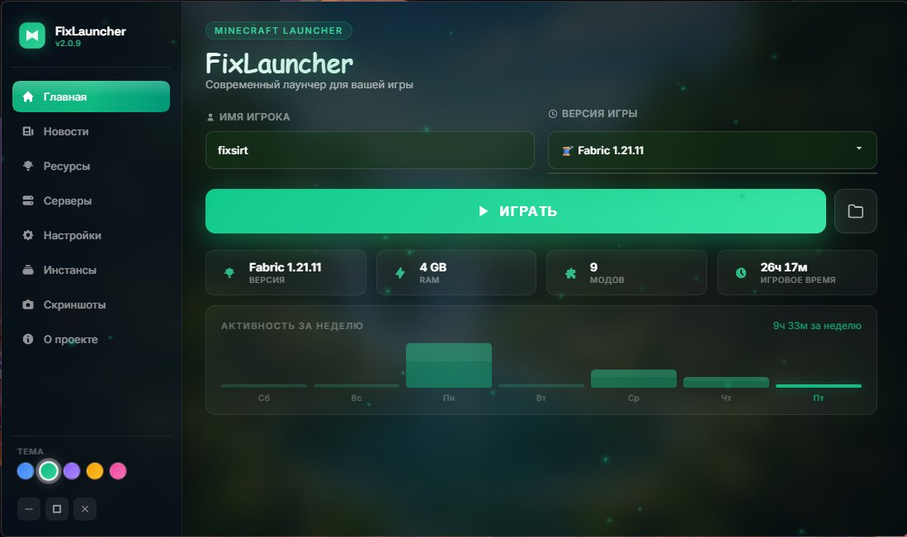
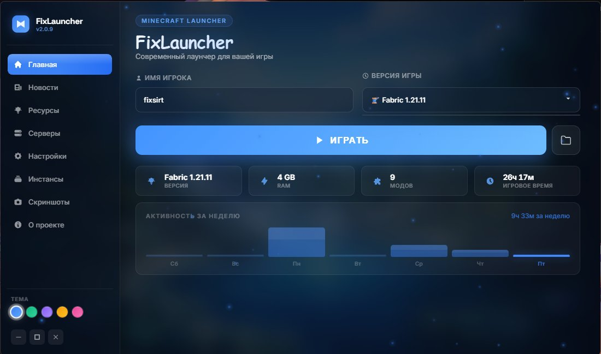
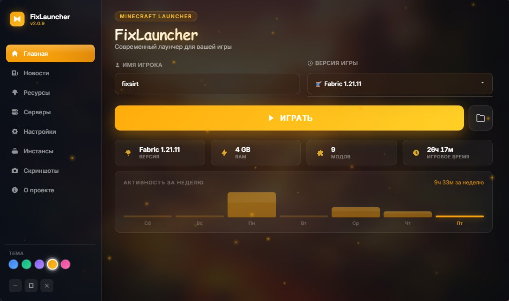
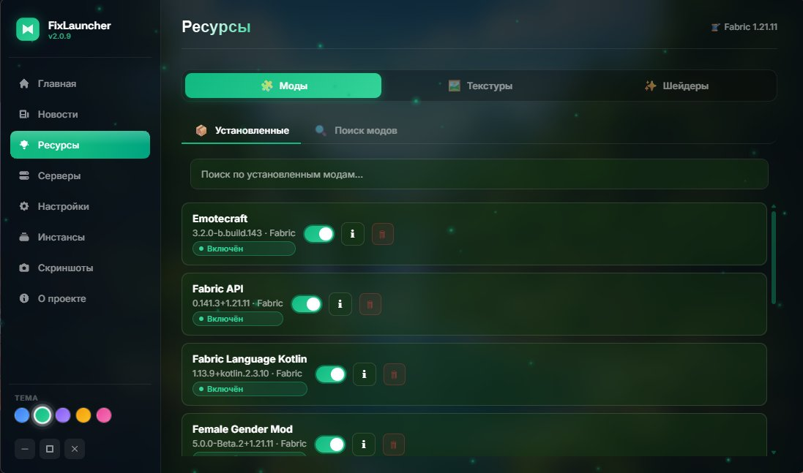
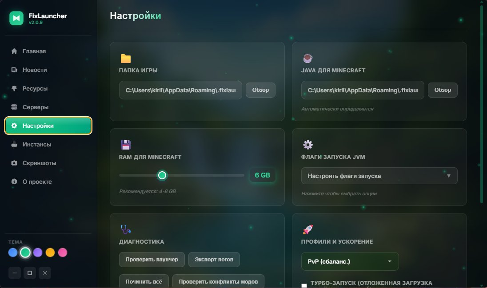
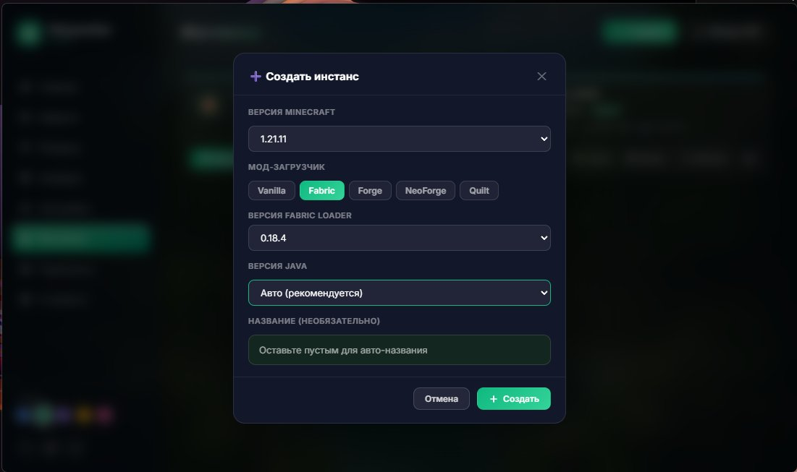
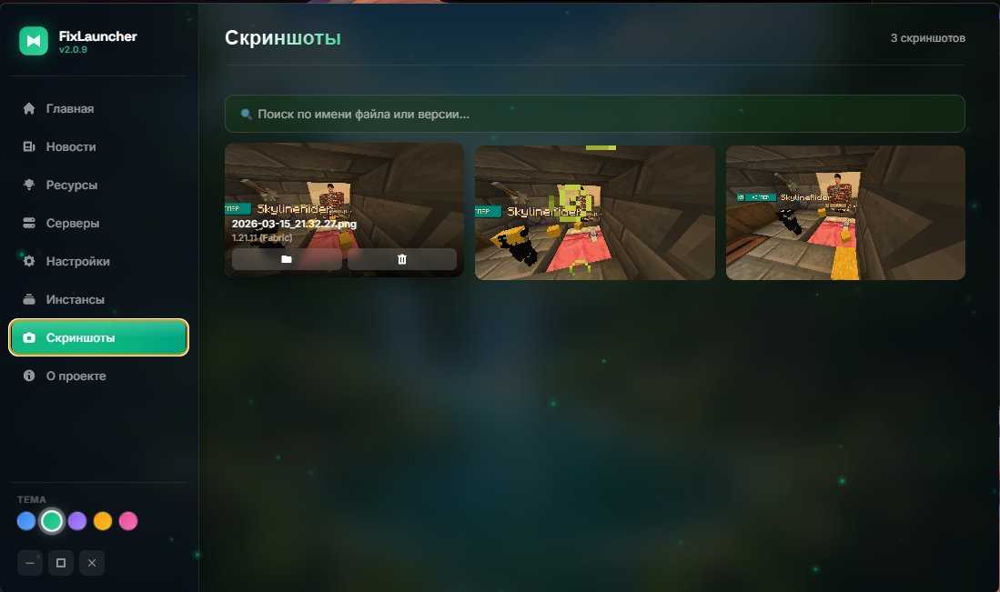

# 🚀 FixLauncher — лаунчер для Minecraft

> **Запускай Minecraft легко, красиво и бесплатно — без регистрации и лишних заморочек!**
## ⬇️ [Скачать FixLauncher (последняя версия)](https://github.com/fixsirt/FixLauncher/releases/latest)

---

## 🤔 Что такое FixLauncher?

FixLauncher — это программа для запуска Minecraft на Windows. Вместо скучного стандартного лаунчера ты получаешь красивый, удобный и мощный инструмент, где всё собрано в одном месте: моды, настройки, скриншоты, серверы и многое другое.

**Работает без лицензии** — просто вводишь своё игровое имя и нажимаешь «Играть». Всё!

---

## 📸 Скриншоты

**Главный экран — тема зелёная**

**Главный экран — тема синяя**

**Главный экран — тема оранжевая**

**Менеджер модов**

**Настройки**

**Создание инстанса**

**Галерея скриншотов**

---

## 💻 Системные требования

- **Операционная система:** Windows 10 или Windows 11 (64-бит)
- **Интернет:** нужен для первого скачивания игры и модов

---

## 📥 Как установить?

1. Перейди на страницу [Releases](https://github.com/fixsirt/FixLauncher/releases) и скачай последний `FixLauncher-Setup.exe`
2. Запусти его и нажми «Установить»
3. Открой лаунчер и введи своё игровое имя
4. Нажми **«Играть»** — готово! 🎮

---

## ✨ Что умеет FixLauncher?

### 🎮 Запуск игры
- **Играй без лицензии** — просто введи любое имя и вперёд в Minecraft!
- **Все версии Minecraft** — от старых до самых новых, выбирай любую
- **Все популярные загрузчики модов** — Fabric, Forge, NeoForge и Quilt доступны прямо в списке версий
- **Прогресс загрузки** — видно, что именно скачивается и сколько осталось

---

### 🗂️ Инстансы (несколько профилей игры)
Представь, что у тебя есть несколько «коробок» с Minecraft — в одной моды для PvP, в другой красивые шейдеры, в третьей — ванилла. Это и есть инстансы!

- **Создавай** любое количество профилей с разными версиями и модами
- **Копируй** инстанс — удобно, если хочешь попробовать что-то новое, не ломая текущую сборку
- **Экспортируй и импортируй** инстансы как ZIP-файл — делись сборками с друзьями!

---

### 🧩 Менеджер модов
- **Ищи моды прямо в лаунчере** — подключён к Modrinth (огромная библиотека модов)
- **Устанавливай в один клик** — нашёл мод → нажал → установлен
- **Включай и выключай моды** — не нужно удалять мод, просто отключи его
- **Обнаружение конфликтов** — лаунчер предупредит, если два мода несовместимы между собой (например, OptiFine и Iris не дружат)
- **Текстур-паки и шейдеры** — устанавливаются так же легко, как и моды

---

### ⚡ Power Tools — настройка производительности
Это как «турбо-кнопка» для Minecraft. Лаунчер предлагает готовые профили под разные задачи:

| Профиль | Для кого | Описание |
|---------|----------|----------|
| 🐢 **Low-end** | Слабый компьютер | Минимум памяти, максимальная стабильность |
| ⚔️ **PvP** | Игра на серверах | Больше FPS, меньше лагов |
| 🌈 **Shaders** | Красивая картинка | Оптимизировано под шейдеры |
| 📹 **Stream** | Запись/стрим | Баланс между игрой и захватом видео |

---

### 🖼️ Галерея скриншотов
- **Все скриншоты в одном месте** — не нужно лазить по папкам
- **Скриншоты из всех версий и инстансов** — всё собрано в одной галерее
- **Удаляй ненужные** прямо из лаунчера

---

### 🌐 Список серверов
- **Заходи на любимые серверы в один клик** — все адреса сохранены в лаунчере
- Не нужно каждый раз вводить IP вручную

---

### 🎨 Красивый интерфейс
- **5 цветовых тем:** синяя, зелёная, фиолетовая, розовая, оранжевая — выбирай, какая нравится
- **Плавные анимации** — никаких рывков при переключении вкладок
- **Смена темы с эффектом** — красивый ripple-эффект при смене цвета

---

### 📊 Статистика игры
- **Активность за неделю** — прямо на главном экране видно, сколько часов ты играл каждый день
- Удобно следить за своими игровыми привычками 😄

---

### 🎵 Discord Rich Presence
- **Статус в Discord** обновляется автоматически — друзья видят, что ты играешь в Minecraft, какую версию и под каким ником
- Подключается сам, без дополнительных настроек

---

### ☕ Управление Java
- **Автоматически находит Java** на компьютере — не нужно настраивать вручную
- **Устанавливает нужную версию Java** самостоятельно, если её нет
- **Можно указать свою Java** — для опытных пользователей

---

### 🔧 Настройки
- **Выдели игре столько RAM, сколько нужно** — ползунком выбери от 1 до 16 ГБ
- **JVM-аргументы** — для тех, кто хочет выжать максимум из своего железа
- **Свой путь для файлов Minecraft** — хочешь хранить игру не на диске C? Без проблем!

---

### 🔄 Автообновление
- Лаунчер **сам проверяет и скачивает обновления** — всегда актуальная версия без лишних действий

---

## 🛡️ Безопасность и конфиденциальность

- Лаунчер **не собирает личные данные** и не требует регистрации
- Подробнее можно прочитать в файле `privacy_policy.md`

---

## 🐛 Нашёл баг?

Пиши в раздел **[Issues](https://github.com/fixsirt/FixLauncher/issues)** — не молчи, вместе сделаем лаунчер лучше! 🙏

---

## 💬 Сообщество и поддержка

- **Telegram-канал:** [t.me/RodFix](https://t.me/RodFix) — новости, обновления, общение
- **Поддержать проект:** [DonationAlerts](https://www.donationalerts.com/r/fixsirt) — если лаунчер нравится, можно сказать спасибо ❤️

---

## 📋 История версий

Полный список изменений: [Releases](https://github.com/fixsirt/FixLauncher/releases)

### v2.0.9
- Обновление версии лаунчера

### v2.0.8
- Добавлены инстансы, галерея скриншотов, текстуры и шейдеры через Modrinth
- Все загрузчики в одном списке версий
- Статистика активности за неделю
- Плавные анимации и мгновенное переключение вкладок

### v2.0.0 — первый публичный релиз
- Базовый запуск игры, менеджер модов, цветовые темы, список серверов, автообновление

---

*Сделано с ❤️ для игроков*
